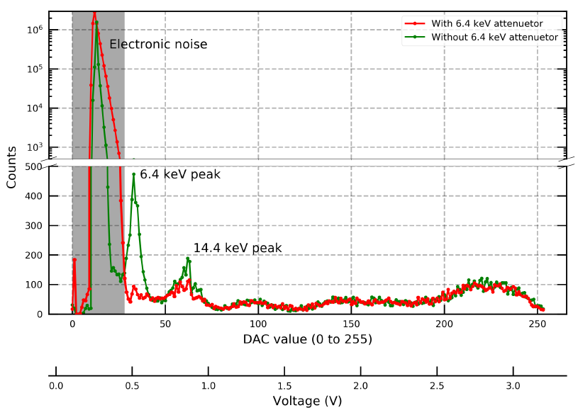

# Open Source Pulse Height Analyzer

**Authors:** Sebastian Montoya and Luis Felipe Ramirez

**Date Created:** August 2023

This repository contains the hardware designs and software applications of the Open Source Pulse Height Analyzer (PHA) developed by the Scientific Instrumentation Group (GICM) at the University of Antioquia. The PHA is an instrument commonly used in nuclear physics to select energies from a radioactive source. However, the primary motivation for designing and implementing this instrument is to accurately characterize the energy peaks of the radioactive source used at our university for Mössbauer spectroscopy. It is well known that in developing countries, acquiring radioactive material is challenging. As a result, the sources used for this material characterization technique can sometimes exceed their useful life and still need to be utilized. Therefore, this instrument enables the identification and filtering of the useful energies needed for this type of spectroscopy, specifically the 14.4 keV line.

Among the planned improvements for this instrument are the use of a higher-resolution DAC and multivibrators capable of operating at high frequencies. These enhancements will allow the pulse discrimination circuit to be utilized in applications with higher event emission rates.

## Contents

- .ino file: Upload this file to the ESP32 microcontroller (ESP32-DEVKITV1) using the Arduino IDE. Please install the ESP32 board first. You can find a tutorial [here](https://www.tutorialspoint.com/esp32_for_iot/installing_the_esp32_board_in_arduino_ide.htm).

- .pdf file: Circuit schematic with component values.

- GUI folder: Contains the Python script with the graphical user interface (GUI). Before running it, make sure to install the required libraries (pyserial, matplotlib, and tkinter). Additionally, edit the GUI file to set the correct COM port number corresponding to the ESP32 board (line 205). After making these adjustments, run the GUI.py, and the GUI should be displayed.

- .zip file: Gerber files that enable you to print the PCB and assemble the PHA hardware. These gerber files are in the format required by JLCPCB.

Please explore the provided files to build and utilize the Open Source Pulse Height Analyzer for your experiments or projects.
